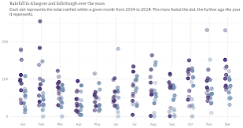
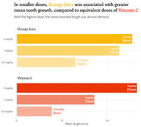

## Outline

- Interactive session
- Graph makeovers

::: {.notes}
Talk about why generating clear visuals is important - particularly in the field of AMR when we're communicating to the general public. 
But also to other scientists, health professionals, government agencies, funding agencies 
:::

## My background

- Microbiologist
- Self-taught data visualisation specialist

## My research

- 

::: {.notes}
Use a one health image
:::

## My research

- 

::: {.notes}
Add in an image of Bhutan, dairy calf, river
:::

## Presenting data clearly

Are you presenting your data your data clearly?
Is your key message clear?

::: {.notes}
Ask the audience to describe how they feel when they look at this image with too many colours.
Today we're going to work through a couple of examples of how to declutter and format your graphs so that the audience/reader is clear where they're supposed to look and what the key message is of the graph
:::

## Presenting data clearly

- No clutter
- Colour with purpose
  - Less is more
  - Accessible colours
  - Transparency
- Reduce eye movement
  - Left aligned text
  - Label directly
  - Horizontal text
- Text hierarchy
- Annotations to highlight observations

- Clear takeaway message

:::: columns
::: {.column width="33%"}

:::

::: {.column width="33%"}

:::

::: {.column width="33%"}

:::

:::::

:::
::: {.notes}
Ask audience what they think works well with these graphs
:::

## Where do you look?

::: {.incremental}

:::

::: {.notes}
Your private presenter notes go here.
Put up an AMR related graph, then follow the same approach that Alex does from data with Storytelling. Ask the audience to close their eyes, open them, take note of where you looked at the graph first then think about how your eyes moved across the slide. https://www.youtube.com/watch?v=0AoS22GoosI People tend to look at the centre first. Where did your eyes look, is it where you want your audience to be looking? Although each person may look at the graph in a different way.  
:::

## How do you feel?

::: {.notes}
Ask the audience to describe how they feel when they look at this image with too many colours. Explain this is dummy data from a paper that analyses AMR data visualisations.
Today we're going to work through a couple of examples of how to declutter and format your graphs so that the audience/reader is clear where they're supposed to look and what the key message is of the graph
:::

## Makeover

::: {.notes}
Before moving to next slide ask audience what clutter they would remove
:::

## Makeover

::: {.notes}
Before moving to next slide ask audience how they would colour with purpose
:::

## Makeover example 2

::: {.incremental}

:::

::: {.notes}
Start without the clutter and only use grey for the clutter. Add in colour, for stacked bars have smallest bars on bottom. Hierachy of information. 
:::

## The elements of a graph

::: {.notes}
Add in here an example of a graph with the features of a clear visual
:::

## What I am doing

::: {.fragment .jackInTheBox}
 Follow similar people - other data visualisation specialists
:::

::: {.fragment .jackInTheBox}
 Post regularly
:::

::: {.fragment .jackInTheBox}
 Share relevant content
:::

## Resources

::: {.incremental}
- Storytelling with Data
- [The Visual Dictory of Antimicrobial Stewardship, Infection Control and Institutional Surveillance Data](https://www.frontiersin.org/journals/microbiology/articles/10.3389/fmicb.2021.743939/full) 
:::

## Summary

