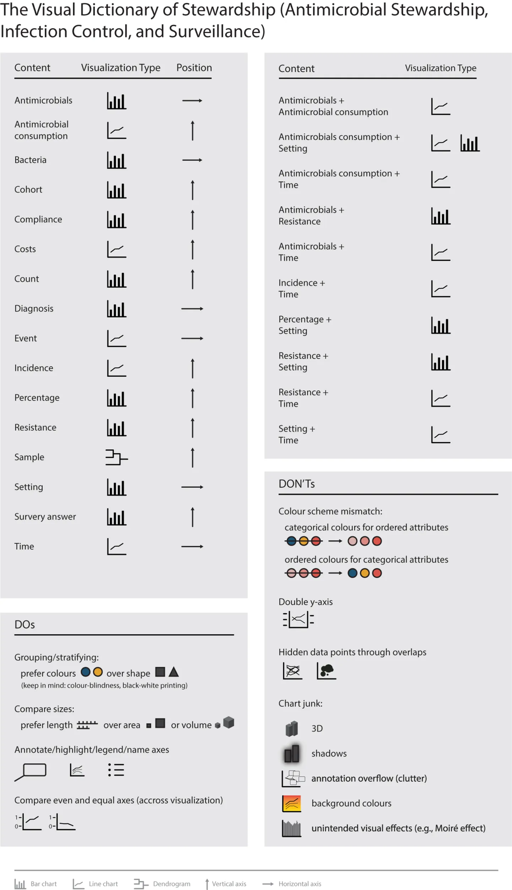
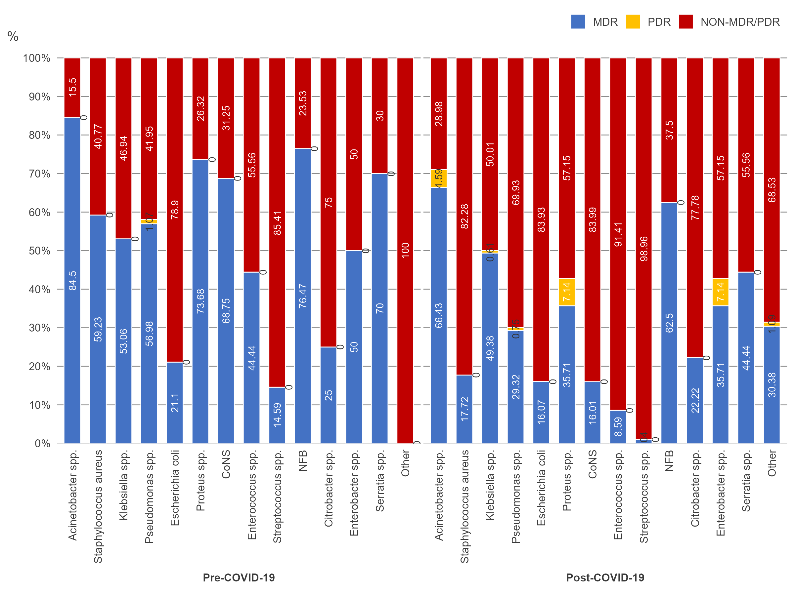
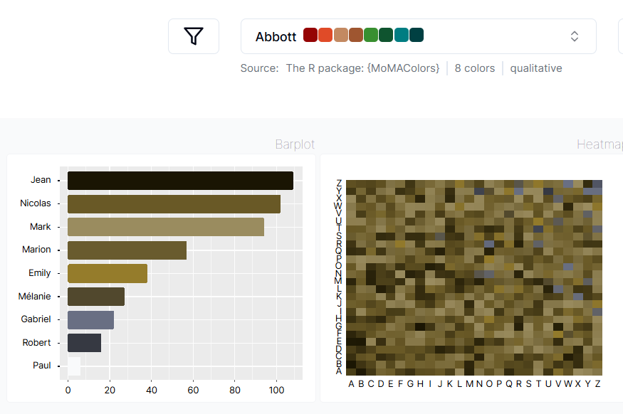
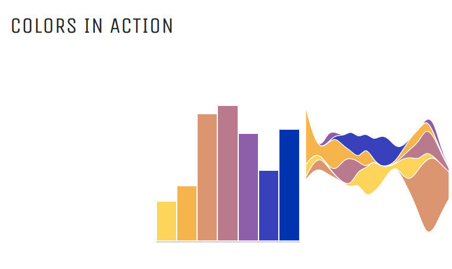
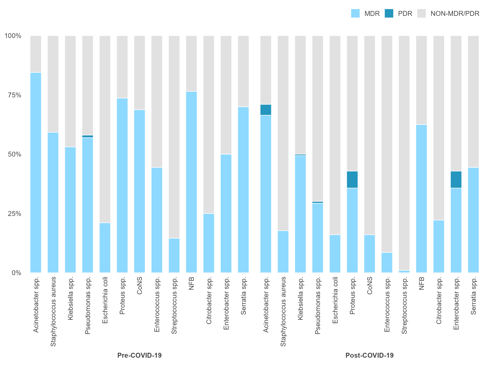

## About me

- Microbiologist and data visualisation consultant/freelancer

- Part-time research officer in the mEpiLab, School of Veterinary Science, Massey University

- Certificate in Applied Statistics and self taught data visualisation specialist

- PhD in Microbiology

- Academic and industry experience in microbiology and genomics

## My research

::: {.notes}
Add in an image of Bhutan, dairy calf, river
:::

## Presenting data clearly

No clutter

::: {#filename filename="data-viz-examples.qmd"}
:::

:::: columns

::: {.column width="50%"}

::: {.placeholder-note}
Image source: [Cedric Scherer, Big Mac Index](https://github.com/Z3tt/TidyTuesday/tree/main/plots/2020_52)
:::
:::

::: {.column width="50%"}

::: {.placeholder-note}
Image source: [Cara Thompson 2023. "Level up your plots"](https://www.cararthompson.com/talks/rladies-edinburgh-level-up-your-plots/)
:::
:::

::::::

## Presenting data clearly

Colour with purpose

:::: columns

::: {.column width="50%"}

:::

::: {.column width="50%"}

:::

::::::

::: {.notes}
Less is more
Accessible colours
Transparency
:::

## Presenting data clearly

Reduce eye movement

:::: columns

::: {.column width="50%"}

:::

::: {.column width="50%"}

:::

::::::

::: {.notes}
Left aligned text
Label directly
Horizontal text
:::

## Presenting data clearly

Text hierarchy

:::: columns

::: {.column width="50%"}

::: {.placeholder-note}
Image source: [Big Mac Index, Cedric Scherer](https://github.com/Z3tt/TidyTuesday/tree/main/plots/2020_52)
:::
:::

::: {.column width="50%"}

::: {.placeholder-note}
Chart by [Cara Thompson](https://github.com/cararthompson/rmedicine2023-workshop/blob/main/level-up-workshop.qmd)
:::
:::

::::::

## Presenting data clearly

Clear takeaway message

:::: columns

::: {.column width="50%"}

::: {.placeholder-note}
Image source: [Big Mac Index, Cedric Scherer](https://github.com/Z3tt/TidyTuesday/tree/main/plots/2020_52)
:::
:::

::: {.column width="50%"}

::: {.placeholder-note}
Chart by [Cara Thompson](https://github.com/cararthompson/rmedicine2023-workshop/blob/main/level-up-workshop.qmd)
:::
:::

::::::

## Presenting data clearly?

Annotations to highlight observations

::: {.notes}
Your private presenter notes go here.
Put up an AMR related graph, then follow the same approach that Alex does from data with Storytelling. Ask the audience to close their eyes, open them, take note of where you looked at the graph first then think about how your eyes moved across the slide. https://www.youtube.com/watch?v=0AoS22GoosI People tend to look at the centre first. Where did your eyes look, is it where you want your audience to be looking? Although each person may look at the graph in a different way.  
:::

## How do you feel?

::: {.placeholder-note}
Image source: [Keizer et al 2021 ](https://www.frontiersin.org/journals/microbiology/articles/10.3389/fmicb.2021.743939/full)
:::

## The Visual Dictionary of Stewardship

:::: columns

::: {.column width="50%"}

:::

::: {.column width="50%"}

:::

::::

::: {.notes}
Ask the audience to describe how they feel when they look at this image with too many colours. Explain this is dummy data from a paper that analyses AMR data visualisations.
Today we're going to work through a couple of examples of how to declutter and format your graphs so that the audience/reader is clear where they're supposed to look and what the key message is of the graph
:::

## Who is your audience?

## Makeover

::: {.notes}
Before moving to next slide ask audience what clutter they would remove
:::

::: {.placeholder-note}
Image source: [Golli et al 2024 ](https://www.mdpi.com/1424-8247/17/4/407)
:::

## Makeover

Lets declutter

::: {.fragment}

:::

::: {.notes}
Before moving to next slide ask audience how they would colour with purpose
:::

## Makeover

- Colour with purpose [image color picker](https://imagecolorpicker.com/)

{height="450px"}

::: {.notes}
Add in here an example of a graph with the features of a clear visual
:::

## Makeover

- Colour with purpose [image color picker](https://imagecolorpicker.com/)

::: {.fragment fragment-index="1"}
- Less is more
:::

::: {.fragment fragment-index="2"}
- Use accessible colour palettes
:::

:::: columns

::: {.column width="50%"}

{.fragment fragment-index="2"}

::: {.placeholder-note}
Image source: [R Graph Gallery, Colour Palette Finder](https://r-graph-gallery.com/color-palette-finder)
:::

:::

::: {.column width="50%"}

{.fragment fragment-index="2"}

::: {.placeholder-note}
Image source: [Viz Palette, Susie Lu](https://projects.susielu.com/viz-palette)
:::

:::

::::

## Makeover

Colour with purpose

## Makeover

Reduce eye movement

## Makeover

Reduce eye movement

## Makeover

Clear message

## Makeover

Clear message, text hierarchy

## Resources

::: {.incremental}
- [Storytelling with Data](https://www.storytellingwithdata.com/)
- [The Visual Dictory of Antimicrobial Stewardship, Infection Control and Institutional Surveillance Data](https://www.frontiersin.org/journals/microbiology/articles/10.3389/fmicb.2021.743939/full)
- [R Graph Gallery - Top R Graph Examples] (https://r-graph-gallery.com/best-r-chart-examples.html)
:::

## Summary

